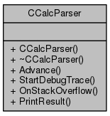
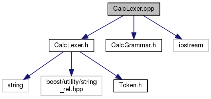

# Calculator with LALR parser

Calculator takes input line-by-line and interprets each line as expression.

##### Input
```
21 + 13 - (1.12 * 2 - 1.51 / 2)
```

##### Output
```
32.515
```

### Implementation details

- Bash script used to call Lemon parser generator and rename `CalcGrammar.c` to `CalcGrammar.cpp`
- Lemon generates C-style LALR parser incapsulated in function `ParseCalcGrammar`, file `CalcGrammar.cpp`
- Manual-written C++ class `CCalcParser` wraps C-style code



- Manual tokenizer `CCalcLexer` supplies tokens using definitions generated by Lemon in `CalcGrammar.h`



### Debug trace

You can enable built-in tracing mechanism to see how LALR parser woks. Just call `CCalcParser::StartDebugTrace` method with log file, e.g. `stderr`.

### Requirements

- Ubuntu: Install `lemon` package
- MS Windows: compile Lemon from [source code (hwaci.com)](http://www.hwaci.com/sw/lemon/). It's just two files, `lemon.c` and `lempar.c`.
- Use any modern C++ compiler.
