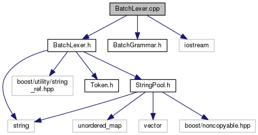
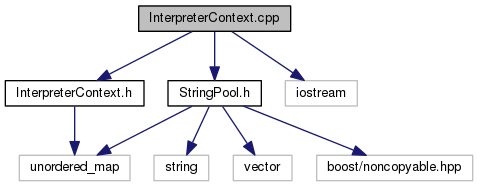
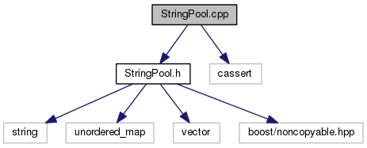

# Interpreter with LALR parser

Interpreter takes input line-by-line and interprets each line variable assignment or print.

##### Input
```
print 21 + 13 - (1.12 * 2 - 1.51 / 2)
x = 10
y = 12.2
print x*y
```

##### Output
```
result: 32.515
result: 122
```

### Changes since lemon-1-calculator example

- New tokens (terminals) `TK_NEWLINE`, `TK_ID`, `TK_ASSIGN`, `TK_PRINT`.
- New non-terminals `statement_line`, `statement_lines_list`.
- `struct SToken` now keeps line/column number and various types in `union`.
- `CCalcLexer` renamed to `CBatchLexer`, it supplies tokens for *one line of code*.



- `CCalcParser` renamed to `CBatchParser`, it has 3 new methods to accept events from generated code.


- New `class CInterpreterContext` keeps variables and reacts on parser events.



- New `class CStringPool` used to map variable name to unique id (`unsigned int`). It's easy way to avoid C-style union limitations: we can't keep `std::string` to LALR stack, but can keep `unsigned int` key known to string pool. This trick also called "string pooling".



### LEMON tricks shown in sample

- There are no error recovery. Any line with syntax error will break parsing.
- The rule `statement_line` added just to ensure that `statement` reduce callback called after newline. If you'll remove `statement_line`, than `print` output will be delayed. Example:

##### Input
```
print 3
print 2
<waiting for the next line>
```

##### Output
```
3
<waiting for the next line>
```

### Requirements

- Ubuntu: Install `lemon` package
- MS Windows: compile Lemon from [source code (hwaci.com)](http://www.hwaci.com/sw/lemon/). It's just two files, `lemon.c` and `lempar.c`.
- Use any modern C++ compiler.
